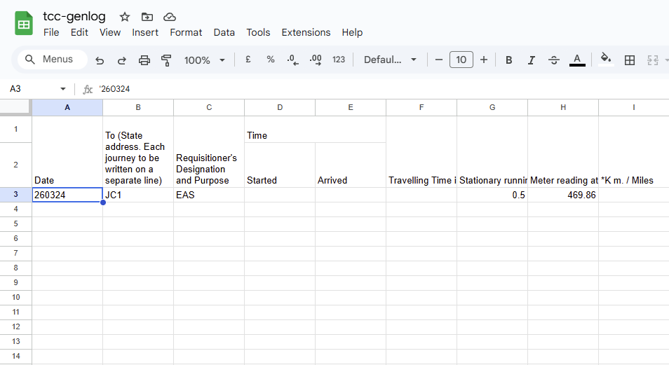

# TCC Generator Digital Logbook
A [Streamlit app](https://hpesoj-tcc-genlog.streamlit.app/) to faciliate the logging of generator meter readings in TCC.

# Features
- Integration with Google Sheets
- Automatic logging to specified date
- In-app generator log viewer

# Usage

## Autofill

Fill the corresponding [sheet](https://docs.google.com/spreadsheets/d/14vNYY24YcFoJ7-aKJCqSyJboYIX7ZlmY4S_0SS2gFTY/edit?usp=sharing) with the last few rows of data from the original generator logbook.

At least one row needs to be filled, but it is recommended to fill the sheet back to the latest POL top up entry.

Add a single quote (') at the start of every date. (e.g. '260324)

Select the corresponding generators in the `Choose generators...` dropdown and the end date of the autofill function.

When prompted, a name can optionally be entered.

## Viewing Logs

The viewing of generator logs can be done in the [sheet](https://docs.google.com/spreadsheets/d/14vNYY24YcFoJ7-aKJCqSyJboYIX7ZlmY4S_0SS2gFTY/edit?usp=sharing), or directly on the app.

Select a generator in the `Choose a generator log to view...` dropdown and the generator log will automatically load.

The `Open Sheet` button links to the original sheet.
